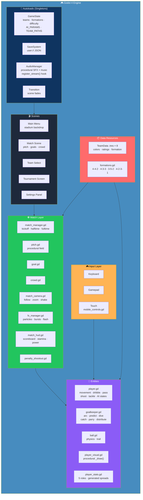
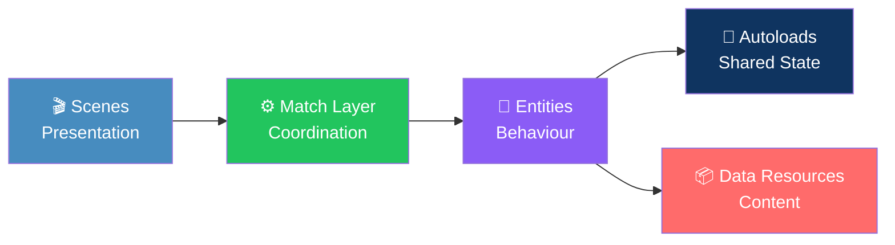
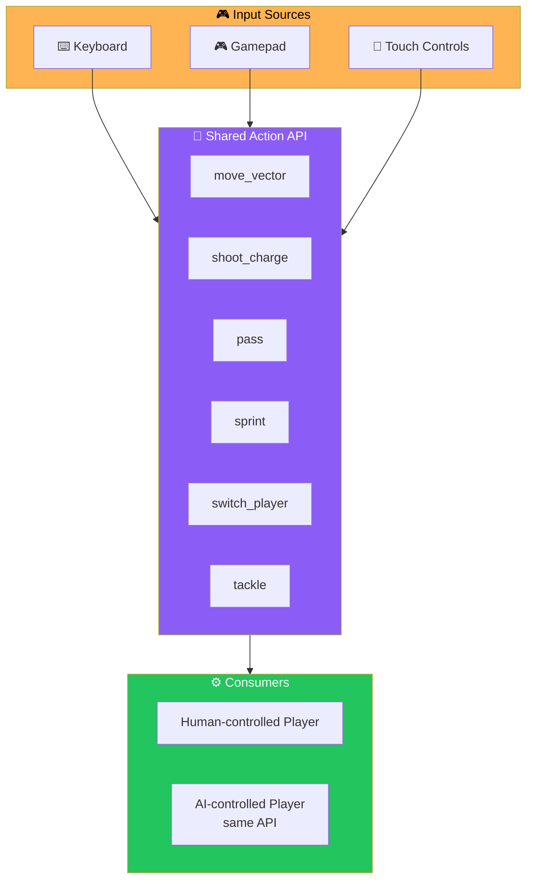
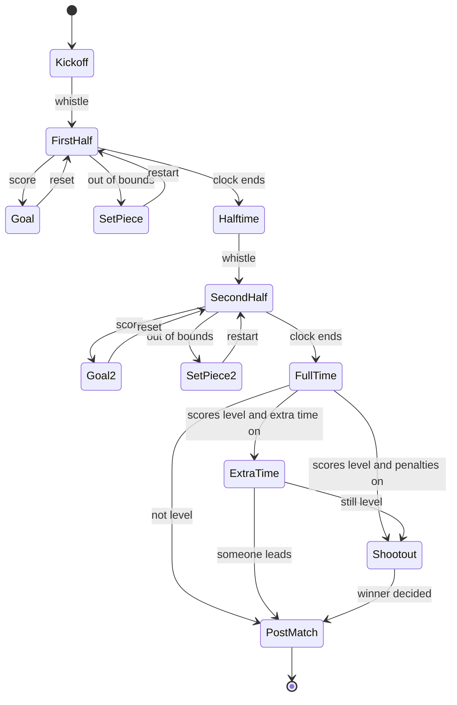
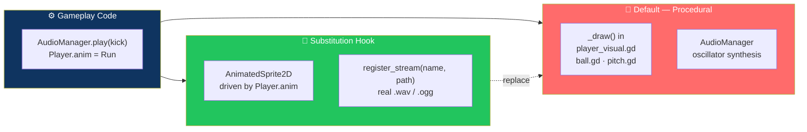

# ⚽ Striker League — 2D Arcade Football

<div align="center">


**A complete, playable top-down arcade football prototype.**

*Real Godot 4.x project — not a web/HTML mockup.*

[🎮 Play It](#-getting-started) • [✨ Features](#-whats-implemented) • [🏗️ Architecture](#️-architecture) • [📂 Structure](#-project-structure) • [🎨 Replacing Placeholders](#-replacing-placeholders) • [📝 Known Limitations](#-known-limitations--next-steps)

</div>

---

## 📖 Overview

**Striker League** is a **complete, playable top-down arcade football prototype** built as a **real Godot 4.x project** — not a web/HTML mockup.

### Core Idea

> **No external art or audio assets are required.**
>
> Sprites, the pitch, the crowd, particle effects, and every sound effect — including a looping chiptune-style music track — are **generated procedurally at runtime**. The project runs immediately after import. Swap in real assets later without touching gameplay code.

---

## 🚀 Getting Started

### Requirements

- **Godot 4.3+** — Godot 4.5 stable also works

### Run It

1. Open the **`striker_league/`** folder in Godot
2. Use **Project → Import**
3. Press **F5**

> ✅ **That's it.** No dependencies, no build step, no missing assets.

---

## ✨ What's Implemented

<div align="center">

| 🎮 Main Menu | 👥 8 Fictional Teams |
|:---:|:---:|
| Animated stadium backdrop · sweeping floodlights · crowd · bouncing ball | Colors · procedural logos · attack/midfield/defense/GK ratings · default formation |
| **⚽ Full Match Simulation** | **🏃 Player System** |
| Procedural pitch · dynamic camera · zoom + shake | Acceleration · stamina · sprint · arcade dribbling · passing · charge-up shooting · slide tackles · 5 roles |
| **🧤 Goalkeeper AI** | **🧠 Real Team AI** |
| Arcs along the goal line · predicts trajectories · dives · catches · parries · distributes | 9 explicit states · designated presser · man-marking · formation-relative positions · lane-aware passing |
| **📊 3 Difficulty Levels** | **📐 4 Formations** |
| Easy · Normal · Hard — changes reaction, accuracy, positioning, speed, tackle success, GK skill | 4-4-2 · 4-3-3 · 3-5-2 · 4-2-3-1 |
| **🎯 Full Match Systems** | **🎉 Match Events & Juice** |
| Kickoff · half-time · extra time · penalties · throw-ins · corners · goal kicks · fouls · full stats | Animated banners: "GOAL!" · "WHAT A SAVE!" · "MISS!" · "OFF THE POST!" · "FULL TIME!" |
| **📺 HUD** | **✨ Visual Effects** |
| Scoreboard · clock · stamina bar · pass-target ring · power meter · pause menu | Ball trail · particles · goal bursts · screen shake · goal flash · animated nets · pixel crowd |
| **🔊 Procedural Audio** | **🏆 Tournament Mode** |
| Every sound synthesized at startup | 8-team single-elimination bracket · CPU fixtures · persisted across sessions |
| **🥅 Penalty Shootout** | **💾 Save System** |
| Standalone or after a draw · best-of-5 + sudden death | JSON in `user://` — settings, teams, career stats, tournament state |
| **⚙️ Settings** | **🎮 Full Input Support** |
| Volume · difficulty · duration · extra time · penalties · fullscreen · aim assist · touch mode | Keyboard · gamepad · on-screen touch controls |

</div>

### 🎮 Main Menu

An **animated stadium backdrop** with:

- Sweeping floodlights
- Crowd
- Bouncing ball

**Menu options:**

- PLAY
- QUICK MATCH
- TOURNAMENT
- PENALTY SHOOTOUT
- TEAMS
- SETTINGS
- HOW TO PLAY
- EXIT

Plus **staggered button animations** and **hover/click sounds**.

### 👥 8 Fictional Teams

Defined in **`data/teams/*.tres`** using a **`TeamData`** resource:

- Colors
- A **procedurally-drawn logo**
- Attack / midfield / defense / goalkeeper ratings
- Default formation

**Team selection screen** with rating bars — also doubles as a read-only **"TEAMS" browser**.

### ⚽ Full Match Simulation

- **Procedurally drawn pitch** — lines, penalty/goal areas, center circle, corner arcs, advertising boards
- **Animated crowd**
- **Night floodlights**
- **Smooth dynamic camera** — follows the ball/player
- **Zooms with the action** and **shakes on big moments**

### 🏃 Player System

| Feature | Details |
|---------|---------|
| **Movement** | Acceleration / top-speed, stamina drain & recovery, sprint |
| **Dribbling** | **Arcade style** — the ball "breathes" on a spring rather than sticking to the player, harder to control at speed |
| **Passing** | Nearest/aimed teammate with **lead-prediction** and **lane-danger scoring** |
| **Shooting** | **Charge-up** — short/medium/long press → weak/normal/powerful shot with a power meter |
| **Tackling** | Slide tackles with **success/foul resolution** |
| **Roles** | 5 roles — **GK / DEF / MID / WING / STR** — each with their own generated stat spread |

### 🧤 Goalkeeper AI

- **Arcs along the goal line**
- **Predicts shot trajectories** — ball flight is simulated ahead
- **Reacts** after a **skill-scaled delay**
- **Dives**
- **Catches slow shots outright**
- **Parries fast ones**
- **Comes off the line** for loose balls in the box
- **Distributes** after a hold

### 🧠 Real Team AI

> **Not "chase the ball."**

**Explicit states:**

- Idle
- Positioning
- ChasingBall
- Attacking
- Defending
- Marking
- Passing
- Shooting
- Tackling
- ReturningToPosition

**Plus:**

- Designated **presser(s) / chaser**
- **Man-marking** of unmarked opponents
- **Formation-relative home positions** that shift with the ball
- **Supporting-run positioning** when a teammate has the ball
- **Lane-aware** passing and shot selection

### 📊 3 Difficulty Levels

**Easy / Normal / Hard** — changes:

- Reaction time
- Pass/shot accuracy
- Positioning discipline
- Speed
- Tackle success
- Press count
- Goalkeeper skill

> 📖 **See `AI_PARAMS` in `scripts/systems/game_state.gd`.**

### 📐 4 Formations

**4-4-2 · 4-3-3 · 3-5-2 · 4-2-3-1**

Selectable for the player's team. AI opponents use their team's default.

### 🎯 Full Match Systems

- Kickoff
- Configurable match length
- Half-time break
- Second half
- **Extra time**
- **Penalty shootout hand-off** when scores are level
- Throw-ins
- Corners
- Goal kicks
- Fouls
- **Possession / shots / on-target / saves / corners / fouls stats**
- **Goal scorer + assist tracking**
- Post-match summary

### 🎉 Match Events & Juice

| Event | Sequence |
|-------|----------|
| **Goal** | Stop → animated banner → scorer → crowd roar → net bulge → reset |
| **Other events** | Kickoff · corner · goal kick · throw-in · foul whistle · save · half-time · full-time |

**On-screen animated notifications:** "GOAL!" · "WHAT A SAVE!" · "MISS!" · "OFF THE POST!" · "FULL TIME!"

### 📺 HUD

- Scoreboard with team colors and names
- Match clock
- Half indicator
- **Selected-player indicator + stamina bar**
- **Pass-target ring**
- **Shot power meter**
- Animated notification banners
- **Pause menu** — resume / settings / restart / quit

### ✨ Visual Effects

- **Ball motion trail**
- **Kick/dust particles**
- **Goal bursts**
- **Screen shake**
- **Full-screen goal flash**
- **Animated goal nets**
- **Speed dust**
- **Animated pixel-crowd** that reacts (jumps, waves) to excitement

### 🔊 Procedural Audio

**Every sound is synthesized at startup by `AudioManager`:**

- Kick
- Pass
- Tackle
- Save
- Post
- Goal fanfare
- Whistle
- Click / hover
- Crowd cheer / groan
- Stadium ambience bed
- **Looping music**

> 💡 **`AudioManager.play("kick")` — an autoload other systems call by name, with a `register_stream()` hook for dropping in real `.wav` / `.ogg` files later.**

### 🏆 Tournament Mode

- **8-team single-elimination** — Quarter-Final → Semi-Final → Final → Champion
- **Drawn bracket view**
- **Simulated CPU-vs-CPU fixtures**
- **Your own record** — W/L/GF/GA/points
- **Persisted across sessions**

### 🥅 Penalty Shootout

**Standalone from the menu**, or **triggered automatically** after a drawn knockout/quick match.

| Phase | What You Do |
|-------|-------------|
| **Attacking** | Aim with movement keys · hold Shoot to charge power *(too much risks skying it)* · release to strike |
| **Defending** | Choose a dive direction against an AI kicker |

**Format:** Best-of-5, then **sudden death**. Plus an animated scoreboard of makes/misses.

### 💾 Save System

**JSON in Godot's `user://` directory** — works on **desktop, Android, and Web/IndexedDB**.

**Persists:**

- Settings
- Last-selected teams
- Career stats
- In-progress tournament state

### ⚙️ Settings

- Master / music / SFX volume
- Difficulty
- Match duration
- Extra time toggle
- Penalties toggle
- Fullscreen
- Resolution
- Aim assist
- Camera shake
- Touch-control mode

### 🎮 Input

| Input Type | Details |
|-----------|---------|
| **Keyboard** | WASD/arrows · **Space hold-to-charge shoot** · E pass · Shift sprint · Q switch player · T tackle · Esc pause |
| **Gamepad** | Mapped to the same actions |
| **Touch** | On-screen virtual joystick + Shoot/Pass/Sprint/Switch/Tackle buttons — **appear automatically on touch devices** *(or forced on/off in Settings)* |

### 📦 Export-Ready Settings

| Setting | Value |
|---------|-------|
| **Physics** | 60 ticks/sec |
| **Renderer** | GL Compatibility — runs on **Windows / Linux / Android / Web** |
| **Stretch mode** | Canvas-item — resolution independence |

---

## 🏗️ Architecture

### System Overview



### Layered Design



### Component Responsibilities

| Layer | Component | Responsibility |
|-------|-----------|---------------|
| **🔌 Autoloads** | `GameState` | Teams, formations, difficulty, `AI_PARAMS`, `TEAM_PATHS` — **the single source of truth for tuning** |
| **🔌 Autoloads** | `SaveSystem` | JSON persistence in `user://` — settings, teams, career stats, tournament state |
| **🔌 Autoloads** | `AudioManager` | Procedural SFX synthesis + looping music; `register_stream()` for real assets |
| **🔌 Autoloads** | `Transition` | Scene-to-scene fades |
| **🎬 Scenes** | `MainMenu` · `TeamSelect` · `Tournament` · `Settings` · `Match` | Screen-level composition and navigation |
| **⚙️ Match** | `match_manager.gd` | Kickoff, halftime, fulltime, extra time, penalty hand-off |
| **⚙️ Match** | `match_camera.gd` | Follow, zoom with action, screen shake |
| **⚙️ Match** | `fx_manager.gd` | Particles, bursts, flash, screen effects |
| **⚙️ Match** | `match_hud.gd` | Scoreboard, clock, stamina bar, pass-target ring, power meter |
| **⚙️ Match** | `pitch.gd` · `goal.gd` · `crowd.gd` | Procedural field, goals, animated pixel crowd |
| **⚙️ Match** | `penalty_shootout.gd` | Standalone or triggered shootout |
| **🏃 Entities** | `player.gd` | Movement, stamina, dribble, pass, shoot, tackle, **AI states** |
| **🏃 Entities** | `goalkeeper.gd` | Arc, trajectory prediction, dive, catch, parry, distribute |
| **🏃 Entities** | `ball.gd` | Physics, trail rendering |
| **🏃 Entities** | `player_stats.gd` | 5 roles with generated stat spreads |
| **🏃 Entities** | `player_visual.gd` | Procedural `_draw()` — art placeholder |
| **🎮 Input** | Keyboard · Gamepad · Touch | All three feed the **same action API** entities consume |
| **📦 Data** | `TeamData .tres × 8` | Colors, ratings, default formation |
| **📦 Data** | `formations.gd` | 4 formation definitions |

### Input Abstraction — One API, Three Sources



> 💡 **The AI reads the same movement/kick/tackle API a human uses.** This is what keeps the AI honest — it can't cheat because it goes through the same interface.

### Match Lifecycle — State Flow



### Procedural Art & Audio — The Substitution Seam



> ✅ **Gameplay never knows whether it's drawing procedurally or playing a real sprite.** It calls the same names either way — so swapping assets is **zero-touch on gameplay code**.

### Design Principles

<div align="center">

| Principle | Implementation |
|-----------|---------------|
| **🔌 Autoloads own shared state** | `GameState`, `SaveSystem`, `AudioManager`, `Transition` — no scene reaches into another scene |
| **🎯 One input API, three sources** | Keyboard, gamepad, and touch all feed the same actions — AI consumes the same API |
| **📦 Content is data** | Teams are `.tres` resources; formations are data tables — no hard-coded rosters |
| **🎛️ Tuning in one place** | `GameState.AI_PARAMS` and difficulty tables — one file to balance |
| **🎨 Assets are optional** | Procedural `_draw()` and synthesized audio are the fallback; `register_stream()` and `AnimatedSprite2D` are the substitution seam |
| **🧠 AI uses the human API** | AI states drive the same movement/kick/tackle calls a player does — no cheating paths |
| **💾 Persistence is central** | Only `SaveSystem` touches `user://` — everything else asks it |
| **📦 Export-first** | GL Compatibility, 60 ticks/sec, canvas-item stretch — runs on desktop, Android, and Web |

</div>

---

## 📂 Project Structure

```
striker_league/
├── project.godot            # autoloads, input, display, physics config
├── scenes/                  # main_menu, match, players, ball, goalkeeper, menus, ui
│
├── scripts/
│   ├── player/               player.gd · goalkeeper.gd · player_stats.gd · player_visual.gd
│   ├── ai/                    (AI logic lives inside player.gd / goalkeeper.gd)
│   ├── ball/                  ball.gd
│   ├── match/                 match_manager.gd · pitch.gd · goal.gd · crowd.gd
│   │                          fx_manager.gd · match_camera.gd · penalty_shootout.gd
│   ├── teams/                 team.gd · team_data.gd · formations.gd
│   ├── ui/                    main_menu.gd · team_select.gd · tournament_screen.gd
│   │                          match_hud.gd · mobile_controls.gd · settings_panel.gd
│   │                          stadium_backdrop.gd · team_card.gd · ui_kit.gd
│   └── systems/               game_state.gd · save_system.gd · audio_manager.gd · transition.gd
│
└── data/teams/*.tres          # 8 TeamData resources (ratings, colors, formation)
```

### 📂 About `scripts/ai/`

> **`scripts/ai` is intentionally empty as a placeholder for future dedicated AI resources.**
>
> The shipped AI is implemented as **behaviour on `Player`/`Goalkeeper`** — driven by per-team `AI_PARAMS` — so it can read the **same movement/kick/tackle API a human uses**.
>
> **Splitting it into standalone strategy resources is a natural next refactor** once you start tuning it.

---

## 🎨 Replacing Placeholders

### 🖼️ Art

**Current:** Gameplay draws players/ball/pitch procedurally in each node's `_draw()`:

- `player_visual.gd`
- `ball.gd`
- `pitch.gd`

**How to swap in real art:**

1. Add an **`AnimatedSprite2D`** in `PlayerVisual` / `Ball`
2. Drive it via **`Player.anim`** — an enum:
   - Idle
   - Run
   - Sprint
   - Shoot
   - Pass
   - Tackle
   - Celebrate
   - Hurt
   - Dive
3. Remove the `_draw()` calls

### 🔊 Audio

**Step 1:** Put your audio files in `assets/audio/`

**Step 2:** Register them once:

```gdscript
AudioManager.register_stream("kick", load("res://assets/audio/kick.wav"))
```

> ✅ **Every gameplay system already calls sounds by name** — `AudioManager.play("kick")` — **so no other code needs to change.**

### 👥 Teams & Logos

1. Add more `.tres` files under `data/teams/` following the existing ones
2. List the path in **`GameState.TEAM_PATHS`**

---

## 📝 Known Limitations & Next Steps

> ⚠️ **This was built and statically reviewed in a sandboxed environment without a Godot binary available to run/compile it.**

**Please treat the first import as a bring-up pass:**

1. Open it in the **Godot editor**
2. Check the **Output panel** for any typos it surfaces
3. Playtest a **quick match end-to-end**

### The Architecture Is Ready

- ✅ State machine
- ✅ Signals
- ✅ Autoloads
- ✅ Per-role stat generation
- ✅ Difficulty params

### Natural Next Steps

- 🎛️ **Tuning AI constants** in `GameState.AI_PARAMS`
- 🎨 **Replacing placeholder art/audio** per the section above
- 🎮 **Adding controller-remapping UI** — gamepad already works with fixed bindings

---

## 🗺️ Roadmap

### ✅ Current

- [x] Main menu with animated stadium backdrop
- [x] 8 fictional teams with ratings and formations
- [x] Team selection with rating bars
- [x] Full match simulation with dynamic camera
- [x] Player system — movement, stamina, sprint, dribbling, passing, shooting, tackling
- [x] 5 player roles with distinct stat spreads
- [x] Goalkeeper AI with trajectory prediction, dives, catches, parries, distribution
- [x] Real team AI with 10 explicit states
- [x] Man-marking and formation-relative positioning
- [x] 3 difficulty levels
- [x] 4 formations
- [x] Full match systems — kickoff, half-time, extra time, penalties, set pieces, fouls, stats
- [x] Goal scorer and assist tracking
- [x] Post-match summary
- [x] Match events with animated notifications
- [x] Full HUD — scoreboard, clock, stamina, pass-target, power meter
- [x] Visual effects — trail, particles, bursts, shake, flash, nets, crowd
- [x] Fully procedural audio with `register_stream()` hook
- [x] 8-team tournament mode with bracket view and persistence
- [x] Penalty shootout — standalone and triggered after draws
- [x] Save system with JSON in `user://`
- [x] Full settings panel
- [x] Keyboard, gamepad, and touch input
- [x] Export-ready project settings

### 🔜 Future Ideas

- [ ] Dedicated AI strategy resources in `scripts/ai/`
- [ ] Controller-remapping UI
- [ ] Real sprite art pipeline
- [ ] Real audio asset pipeline
- [ ] More formations and tactical options
- [ ] Career mode with season progression
- [ ] Replay or highlight capture
- [ ] Online multiplayer
- [ ] Player stats and progression between matches
- [ ] Custom tournament sizes

---

## 🤝 Contributing

Contributions are welcome. Please:

1. Fork the repository
2. **Keep it asset-free by default** — procedural art and audio must remain the fallback
3. **Use the `AudioManager.register_stream()` hook** to add real audio — never hard-code paths
4. **Keep AI constants in `GameState.AI_PARAMS`** — one place to tune
5. **Preserve the input API** — AI and humans share the same movement/kick/tackle interface
6. Test in the Godot editor before submitting
7. Submit a Pull Request

### Guidelines

- **Never require external assets** — the project must run immediately after import
- **Never bypass `AudioManager`** — call sounds by name
- **Never hard-code team data** — use `.tres` resources under `data/teams/`
- **Preserve the export settings** — GL Compatibility, 60 ticks/sec
- **Keep touch controls auto-detecting** — don't force them on desktop

---

## 📜 License

MIT — see [LICENSE](LICENSE) for details.

---

## 🙏 Acknowledgments

- **Godot Engine** — for making a full football game possible in GDScript
- **Every arcade football game from the 90s** — this one's for you
- **Every developer who's ever shipped a prototype without a single asset** — this is the proof it works

---

<div align="center">

### ⚽ KICK OFF. SCORE. LIFT THE TROPHY.

**No external assets. No missing files. Just import and play.**

**Procedural art. Procedural audio. Real gameplay.**

<br>

⭐ If you enjoyed this prototype, consider giving it a star.

<br>

[⬆ Back to Top](#-striker-league--2d-arcade-football)

</div>
